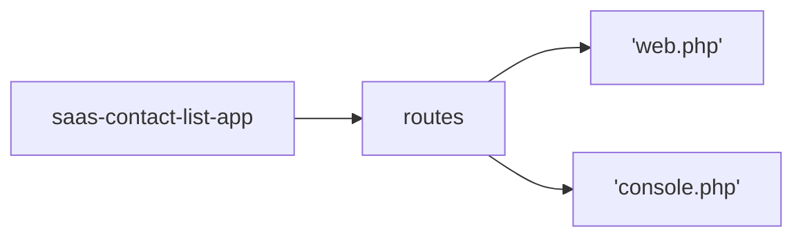
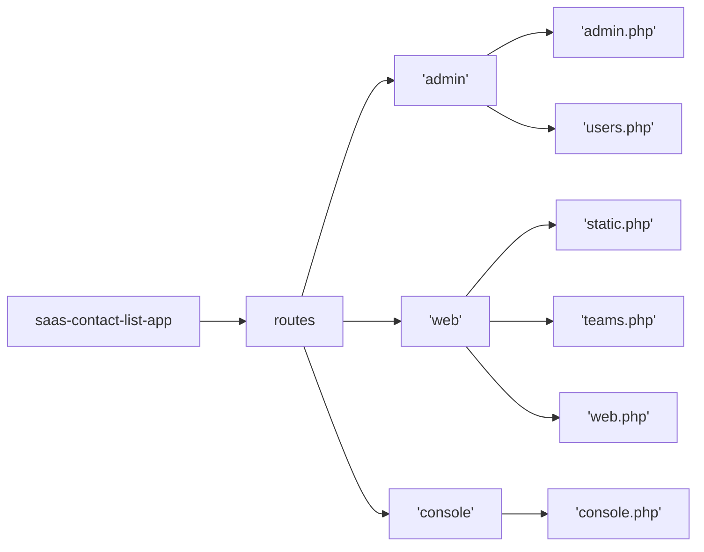
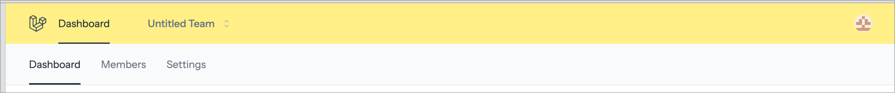
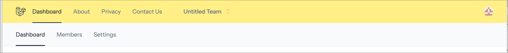
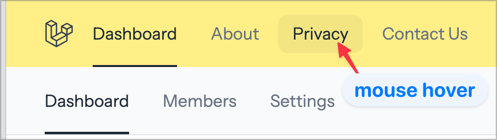
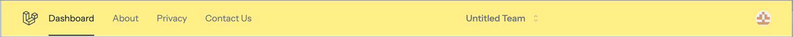
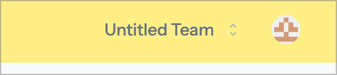
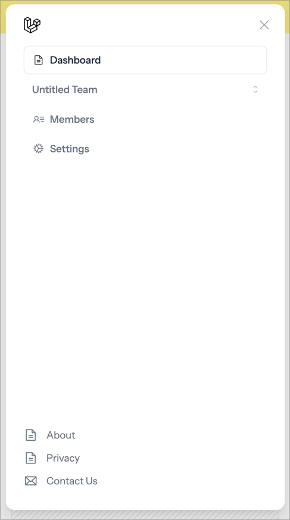
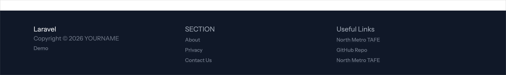

Create Base Application using:

> **Note:** Shell command is One line, split into 3 for ease of reading

```shell
laravel new saas-contact-list-app  
  --using=imacrayon/blade-starter-kit --git  
  --database=sqlite --pnpm

cd saas-contact-list-app
```

Add the LaraDumps package to enable the App to talk to LaraDumps App.

```shell
composer require --dev laradumps/laradumps 
```

Freshen up the ReadMe.md file (this file)

```shell
touch Readme.md
```

Perform the initial migrations and seed the database:

```shell
php artisan migrate:fresh --seed
```

Either split your shell into two parts, or open another shell.

Make sure that your current folder shows the saas-contact-list-app folder. If not use the
`cd` command to move into the correct folder/directory.

```shell
pwd
```

In the second shell run the application:

```shell
composer run dev
```

Most commands will be executed in the first shell, leaving the application to continue
running in the background.

Open the default application on a web browser: [http://localhost:8000](http://localhost:8000).


Create an Update User Migration

We need to add a few fields to the user model, so we will create a new migration:

```shell
php artisan make:migration update_users_add_name
```

Open and edit the `database/migrations/yyyy_mm_dd_hhmmss_update_users_ad_name.php` file:

Update the `up` and `down` methods:

```php
public function up(): void
    {
        Schema::table('users', function (Blueprint $table) {
            $table->string('name',32);
        });
    }


    public function down(): void
    {
        Schema::table('users', function (Blueprint $table) {
            $table->dropColumn('name');
        });
    }

```

Create User Seeder

```shell
php artisan make:seeder UserSeeder
```

Edit the `database/seeders/UserSeeder.php` file.

Update the run method to read:

```php
public function run(): void
{
    $seedUsers = [
        [
            'id' => 99,
            'name' => 'Super Admin',
            'first_name' => 'Super',
            'last_name' => 'Admin',
            'email' => 'supervisor@example.com',
            'password' => 'Password1',
            'email_verified_at' => now(),
            'roles' => ['super-user','admin',],
            'team_role' => 'admin',
            'permissions' => [],
        ],

        [
            'id' => 100,
            'name' => 'Admin I Strator',
            'first_name' => 'Admin',
            'last_name' => 'I Strator',
            'email' => 'admin@example.com',
            'password' => 'Password1',
            'email_verified_at' => now(),
            'roles' => ['admin'],
            'team_role' => 'admin',
            'permissions' => [],
        ],

        [
            'id' => 200,
            'name' => 'Staff User',
            'first_name' => 'Staff',
            'last_name' => 'User',
            'email' => 'staff@example.com',
            'password' => 'Password1',
            'email_verified_at' => now(),
            'roles' => ['staff'],
            'team_role' => 'admin',
            'permissions' => [],
        ],

        [
            'id' => 300,
            'name' => 'Client User',
            'first_name' => 'Client',
            'last_name' => 'User',
            'email' => 'client@example.com',
            'password' => 'Password1',
            'email_verified_at' => now(),
            'roles' => ['client'],
            'team_role' => 'member',
            'permissions' => [],
        ],

        [
            'id' => 301,
            'name' => 'Client User II',
            'first_name' => 'Client',
            'last_name' => 'User II',
            'email' => 'client2@example.com',
            'password' => 'Password1',
            'email_verified_at' => null,
            'roles' => ['client'],
            'team_role' => 'member',
            'permissions' => [],
        ],

        [
            'id' => 302,
            'name' => 'Client User III',
            'first_name' => 'Client',
            'last_name' => 'User III',
            'email' => 'client3@example.com',
            'password' => 'Password1',
            'email_verified_at' => null,
            'roles' => ['client'],
            'team_role' => 'member',
            'permissions' => [],
        ],
    ];

    foreach ($seedUsers as $newUser) {
    
        // Assign user as team member by default
        // This app template has the Teams feature enabled 
        $newUser['role'] = $roles['team_role']??"member";
        unset($newUser['team_role']);

        // Grab the roles & additional permissions from the seed users.
        // This is used by Spatie Permissions package.
        $roles = $newUser['roles'];
        unset($newUser['roles']);

        $permissions = $newUser['permissions'];
        unset($newUser['permissions']);

        $user = User::updateOrCreate(
            ['id' => $newUser['id']],
            $newUser
        );

        // Uncomment this line when using Spatie Permissions
        // $user->assignRole($roles);
        // $user->assignPermissions($permissions);

    }

    // Uncomment the line below to create (10) randomly named users using the User Factory.
    // User::factory(10)->create();
}
```

Open the `database/seeders/DatabaseSeeder.php` file.

Update the class definition to include `WithoutModelEvents`.

```php
namespace Database\Seeders;

use App\Models\User;
use Illuminate\Database\Console\Seeds\WithoutModelEvents;
use Illuminate\Database\Seeder;

class DatabaseSeeder extends Seeder
{
    use WithoutModelEvents;
```

> This tells Laravel NOT to trigger any events such as sending emails that may
> be tied to the creation of user models.

Update the run method in the `database/seeders/DatabaseSeeder.php` file to read:

```php
        $this->call([
            UserSeeder::class,
            //CategorySeeder::class,
            //ContactSeeder::class,

            // This is for demo purposes only
            // DemoSeeder::class,
        ]);
    }
```

Re-execute the migration command:

```shell
php artisan migrate:fresh --seed
```

> IMPORTANT: The `:fresh` resets the database tables to have records. **DO NOT** use it
> on a production database.

You should not have any errors at this point.

Go back to your browser and click the Log in button.


Enter one of the sets of data shown below:

| Item          | Administrator User  | Client User          |
|---------------|---------------------|----------------------|
| Email address | `admin@example.com` | `client@example.com` |
| Password      | `Password1`         | `Password1`          |

> At the moment no difference will be seen between admin and client, per-se.

Logging in will present the default 'dashboard':


Commit work so far

```shell
git add .
git commit -m 'chore: Update & Seed users 
    - Add name field via update migration
    - seed users table via SeedUsers seeder'
```

---

Re-organise Routes

We are going to re-organise the routes to make the code more manageable and expandable.

Current structure is:



We will restructure to:



Create the folders using:
```shell
mkdir -p routes/{web,admin,console}
touch routes/{web,admin,console}/default.php
touch routes/web/{teams,static,profile}.php
touch routes/admin/users.php

cp routes/console.php routes/console/inspire.php
cp routes/console.php routes/console/console.php
cp routes/web.php routes/web/web.php
```

> This creates some empty files ready, plus also copies the original routes files into 
> their respective folders. These, temporarily, act as a backup of the originals.

Open the `routes/console.php` file and update to read:

```php
<?php
# Console Routes
include_once 'console/inspire.php';

# include route files for individual console commands,
# or groups of related commands.
```

Likewise, open the `routes/web.php` file and update it to read:

```php
<?php
# Static page routes: home, about, privacy, et al.

$basePath = dirname(__DIR__);

include_once "{$basePath}/routes/web/static.php";

# Logged-in User Profile routes
include_once "{$basePath}/routes/web/profile.php";

# Teams Routes
include_once "{$basePath}/routes/web/teams.php";

# Administration: Users
include_once "{$basePath}/routes/admin/users.php";

# This should be empty, but may be used to hold general routes
include_once "{$basePath}/routes/web/web.php";

```

> You should see the browser automatically refresh when you save changed files.
>
> You will also see errors when an issue arises due to a problem in a PHP file.

We are now going to copy code from the backup files into the respective route files.

> As these files are larger in most cases, we will link to the source files for viewing:
> 
> - [`routes/web/static.php`](routes/web/static.php)
> - [`routes/web/profile.php`](routes/web/profile.php)
> - [`routes/web/teams.php`](routes/web/teams.php)
> - [`routes/admin/users.php`](routes/admin/users.php)
> - [`routes/console/inspire.php`](routes/console/inspire.php)
> - [`routes/web.php`](routes/web/web.php)
> - [`routes/console.php`](routes/console/console.php)
> - 

You should comment out ALL the `routes/web/web.php` routes as they have been moved to 
representational files above (e.g. teams routes to the `teams.php` route file).

Likewise, the same should be done for the `routes/console/console.php` routes.

Once completed all the routes should still function as expected.


---

Update the Application View Template

- Hide any items that require login to work
- Add page footer

Our next step is to update the `resources/views/components/layouts/app.blade.php` file.

We will be:
- Using `@auth() ... @endauth` to show sections of the page when the user is LOGGED IN.
- Using the `x-button` component for buttons
- Using the `x-navbar` and `x-navbar-item` to create navigation bar(s) and "links"
- Using `x-spacer` to add auto-resizing spaces between navbar sections
- Using `x-popover`, `x-popover.item` and `x-popover.separator` to create dropdown menus

In the steps below, we will show the section fo code to change, and the updated version.

> Before you continue, so that you can double check each change as it happens, you will need to:
> - Go to http://localhost:8000
> - Click Login button
> - Enter the user email of `admin@example.com` and password `Password1`. 
> 
> This will log you in and show you the dashboard, which is shown to users when 
> successfully authenticated.


Open the `resources/views/components/layouts/app.blade.php` file.

Some changes are a stylistic changes to make the code more readable (e.g. splitting long 
lines into shorter ones).

Locate: the first `x-container` and change:

```php
<x-container class="flex items-center max-lg:py-3">
```

to

```php
<x-container class="flex items-center max-lg:py-3 bg-yellow-200">
```

This will colour the logo/user area pale yellow.

Now, immediately under this you find a button:

```php
<x-button type="button" command="show-modal" commandfor="mobile_nav" 
```

We are going to insert a new-line after the `mobile_nav`:

```php
<x-button type="button" command="show-modal" commandfor="mobile_nav" 
          icon size="xs" before="phosphor-list" class="lg:hidden me-3">  
```

A few lines down the code (approximately line 20) you will find:

```php
<x-navbar class="max-lg:hidden">
```

Edit this line and add the class `pl-4`, plus immediately after, add:

```php
 <x-navbar class="max-lg:hidden pl-4">
    @auth()
        {{-- Display Link to the Dashboard for authenticated user --}}
    @endauth

    {{-- Add any default menu items here: About, Privacy, etc --}}
</x-navbar>

<x-spacer/>

<x-navbar class="max-lg:hidden pr-4">
    @guest()
        {{-- Un-authorised user navigation bar --}}
    @else
```

Then after the `{{ __('Settings') }} </x-navbar.item>` navbar item, add:

```php
@endguest
```

We should see no difference in the dashboard if everything is correct.

Let's add a link for the dashboard when a user is authenticated.

Locate the blade comment `{{-- Display Link to the Dashboard for authenticated user --}}`.

Immediately after this, and before the `@endauth` add the code to add the navigation item:

```php
@auth()
    {{-- Display Link to the Dashboard for authenticated user --}}

    <x-navbar.item href="{{ route('app') }}">
        {{ __('Dashboard') }}
    </x-navbar.item>
@endauth
```

Saving changes and checking the re-rendered page should show:



Next we can add default, or static page links.

Immediately after the `@endauth`, we replace `{{-- Add any default menu items here: 
About, Privacy, etc --}}` with the required links:

```php
 <x-navbar.item href="{{ route('home') }}">
    {{ __('About') }}
</x-navbar.item>
<x-navbar.item href="{{ route('home') }}">
    {{ __('Privacy') }}
</x-navbar.item>
<x-navbar.item href="{{ route('home') }}">
    {{ __('Contact Us') }}
</x-navbar.item>
```

For the time being, we will use the `home` route, but later we will be adding the static 
pages and update these routes.

Here is what you should see:



And if you hover over a navigation item it should be highlighted with a light shading of the 
background and darker text.



Now we are going to close the navbar, add a spacer that fills in between the two parts of 
the navbar, and then re-open the navbar.

Immediately after the Contact Us `</x-navbar.item>` we will have:

```php
</x-navbar>

<x-spacer/>

<x-navbar class="max-lg:hidden pr-4">
```

This should shift the Untitled Team navbar item to the right.




Our next step is to add the Guest items. 

The guest items are shown for user who are not logged in. That is unauthenticated.

We will add code between `#guest()` and `@else`:

```php
<x-navbar class="max-lg:hidden pr-4">
    @guest()
        {{-- Un-authorised user navigation bar --}}
        <x-navbar.item href="{{ route('login') }}">
            {{ __('Login') }}
        </x-navbar.item>
        @if (Route::has('register'))
            <x-navbar.item 
                href="{{ route('register') }}"
                class="border px-4 rounded-lg  bg-black text-white
                       hover:bg-gray-800/80 hover:text-white lg:h-8
                       dark:text-white/80 dark:hover:bg-white/7 dark:hover:text-white">
                {{ __('Register') }}
            </x-navbar.item>
        @endif
    @else

```

These lines will add a login and register link to the layout when not authenticated.

> You will not see this untile later, when we replace the welcome page and use the app 
> layout for the base template.

We do not need to change the code for the Teams Link/Dropdown, but we can tidy it up a bit:

```php
@else
    <button type="button" commandfor="header_team_menu" command="toggle-popover"
            class="flex items-center ps-3 ms-3 h-10 w-full rounded-lg text-gray-500
                   cursor-default hover:bg-gray-800/5 hover:text-gray-800 lg:h-8
                   dark:text-white/80 dark:hover:bg-white/7 dark:hover:text-white">
        <span class="text-sm font-medium leading-none">
            {{ auth()->user()->team->name }}
        </span>
        <span class="shrink-0 ml-auto size-8 flex justify-center items-center">
            <x-phosphor-caret-up-down
                aria-hidden="true" width="12" height="12"
                class="text-gray-400 dark:text-white/80 group-hover:text-gray-800
                       dark:group-hover:text-white" />
        </span>
    </button>
    <x-popover id="header_team_menu" justify="left" class="w-max">
        <x-form method="put" action="{{ route('settings.team.update') }}"
                class="grid grid-cols-[auto_1fr]">
            @foreach(auth()->user()->teams as $team)
                <x-popover.item
                    class="col-span-2 grid grid-cols-subgrid"
                    :before="$team->id === auth()->user()->team_id ? 'phosphor-check' : ''"
                    name="team_id" value="{{ $team->id }}">
                        {{ $team->name }}
                </x-popover.item>
            @endforeach
        </x-form>
        <x-popover.separator />
        <x-popover.item before="phosphor-plus" href="{{ route('teams.create') }}">
            {{ __('New Team') }}
        </x-popover.item>
    </x-popover>
@endguest
</x-navbar>
```

We should see a `<x-spacer />` at around line 92, this can be removed with the 
effect of the Team name will now be close to the loggina in usr icon/menu.



Desktop Navigation menu time.

We are now able to add the desktop navigation menu, but onky allowing it to be shown when 
logged in.

You will find the HTML comment for Desktop User Menu. After this, and before the button, add 
the `@auth()` blade macro.

```php
</x-navbar>

<!-- Desktop User Menu -->
@auth()

<button type="button"
```

Move down to approximately lien 120, and locate:

```php
    </x-popover>
</x-container>
<x-container class="flex items-center max-lg:hidden">
```

Before the `</x-container>` and immediately after the `</x-popover>` add `@endauth`:

```php
    </x-popover>
        @endauth
</x-container>
<x-container class="flex items-center max-lg:hidden">
```

Now insert a `@auth()` and `@endauth` wrapper around the  container that follows the above:

```php
@auth()
    <x-container class="flex items-center max-lg:hidden">
        <x-navbar>
            <x-navbar.item href="{{ route('app') }}">
                {{ __('Dashboard') }}
            </x-navbar.item>
            <x-navbar.item href="{{ route('teams.show', auth()->user()->team) }}">
                {{ __('Members') }}
            </x-navbar.item>
            <x-navbar.item href="{{ route('teams.edit', auth()->user()->team) }}">
                {{ __('Settings') }}
            </x-navbar.item>
        </x-navbar>
    </x-container>
@endauth()
```

We are leaving this here, so that when we add functionality to the application, we can add 
menu items to the dashboard as needed.

At the moment the menu is for the dashboard, the current team members, and team settings.

So that is the desktop menu, we are now able to work on the mobile menu

Mobile Menu Update

The mobile section of the navigation will follow the same for of updates.

After our changes, we should find `<x-modal id="mobile_nav"` at approximatelky line 135.

The first `<x-navlist>` will need a `@guest()` added immediately after, and it's 
corresponding `</x-navlist>` will have the `@endguest` immediatley before it (around line 184):

```php
<x-navlist>

    @guest()
        <x-navlist.group>
            {{-- code removed for brevity --}}
        </x-navlist.group>
    @endguest
    
</x-navlist>

<x-spacer/>
```

First we add in links for Login and Register, then add an `@else` ready to show the
authenticated navigation options:

```php
@guest()
    <x-navlist.group class="bg-pink-100 -mx-4 p-4">
        <x-navbar.item href="{{ route('login') }}"
                       before="phosphor-file-text">
            {{ __('Login') }}
        </x-navbar.item>
        @if (Route::has('register'))
            <x-navbar.item href="{{ route('register') }}"
                           class="underline underline-offset-2"
                           before="phosphor-file-text">
                {{ __('Register') }}
            </x-navbar.item>
        @endif
    </x-navlist.group>
@else
```

After the else we then make a couple of changes. Firstly adding the dashboard link to 
immediately after the `@else`, plus open a `x-navlist.group` to wrap the existing toggle button:

```php
@else
    <x-navlist.item before="phosphor-file-text" href="{{ route('app') }}">
        {{ __('Dashboard') }}
    </x-navlist.item>

    <x-navlist.group>
        <button type="button" commandfor="header_mobile_team_menu"
                command="toggle-popover"
```

Then we remove the extra dashboard entry that is just after `New Team` popover and before the 
`Members` link.

```php
        {{ __('New Team') }}
    </x-popover.item>
</x-popover>

{{-- remove the existing dashboard entry from here --}}

<x-navlist.item before="phosphor-user-list"
                href="{{ route('teams.show', auth()->user()->team) }}">
    {{ __('Members') }}
</x-navlist.item>
```

We are almost done with the navigation. The last part is to add the "standard" navigation 
items for about, contact us et al.

Head down the code to approximately line 220 where you will find the `@endcan`.

After this add a new `<x-navlist.group>`, and close it before the `</div>` and `</x-modal>` 
lines.

We add the required defautl menu links at this point as well:

```php

        <x-navlist.group>
            {{-- Add any default menu items here: About, Privacy, etc --}}
            <x-navbar.item href="{{ route('home') }}"
                           before="phosphor-file-text">
                {{ __('About') }}
            </x-navbar.item>
            <x-navbar.item href="{{ route('home') }}"
                           before="phosphor-file-text">
                {{ __('Privacy') }}
            </x-navbar.item>
            <x-navbar.item href="{{ route('home') }}"
                           before="phosphor-envelope">
                {{ __('Contact Us') }}
            </x-navbar.item>
        </x-navlist.group>


    </div>
</x-modal>
```

That's the core navigation completed.

Here is the final "mobile" navigation as it stands with our changes:




Footer

The last step will be to add a Footer.

Scroll down to the end of the template, locate the `</main>`.

It is immediately after this we add new code. We have shown it here without the full footer 
entry.

```php
<main class="flex-1 flex flex-col">
    <x-container 
        class="flex-1 flex flex-col py-6 lg:py-8">
        {{ $slot }}
    </x-container>
</main>

<footer class="mt-4 py-8 bg-gray-900 text-gray-200 px-16">
    <div class="container mx-auto 
                grid grid-cols-1 md:grid-cols-2 lg:grid-cols-3 
                gap-8 ">

    {{-- Add footer code here --}}
    
    </div>
</footer>
```

So what will be added to the footer?

- Section A: Copyright and Application Name
- Section B: General Navigation area
- Section C: Useful Links area

The general navigation could be utilised in many ways, for this demo we add our standard 
navigation items.

The final result will looks similar to this:




Footer Sections

Replace the `{{-- Add footer code here --}}` comment with THREE `section`s.

> Trick: use Emmett coding to speed up the process if your IDE supports it.
> ...
> Type in `section*3` then press the <kbd>TAB</kbd> once to get:


```php
<section></section>
<section></section>
<section></section>
```

Now we can add each section in turn:

Section A: Copyright/App name

```php
<section class="col-span-1 md:col-span-2 lg:col-span-1">
    <ul class="text-sm text-gray-500">
        <li>
            <h4 class="text-lg text-white">
                {{ config('app.name', "Laravel") }}
            </h4>
        </li>
        <li class="text-xs text-gray-600 pb-1">
            {{ config('app.version', "0.0.0") }}
            {{ config('app.codename', "Absent Aardvark") }}
        </li>
        <li>
            Copyright © 2026 YOURNAME
        </li>
    </ul>
</section>

<section></section>
<section></section>
```

Next the General section

Section 2: General navigation area

```php
    {{-- end of section A --}}
</section>

<section>
    <h4 class="text-gray-400">Site</h4>
    <ul>
        <li>
            <x-link href="{{ route('home') }}"
                    class="text-gray-500 text-xs">
                About
            </x-link>
        </li>
        <li>
            <x-link href="{{ route('home') }}"
                    class="text-gray-500 text-xs">
                Privacy
            </x-link>
        </li>
        <li>
            <x-link href="{{ route('home') }}"
                    class="text-gray-500 text-xs">
                Contact Us
            </x-link>
        </li>
    </ul>
</section>

<section></section>
```

Finally the Useful links...

Section C: useful Links

```php
            {{-- end of section B --}}
        </section>
        
        <section>
            <h4 class="text-gray-400">Useful Links</h4>
            <ul>
                <li>
                    <x-link href="https://northmetrotafe.wa.edu.au"
                            class="text-gray-500 text-xs">
                        North Metro TAFE
                    </x-link>
                </li>
                <li>
                    <x-link href="https://github.com/AdyGCode/saas-contact-list-demo"
                            class="text-gray-500 text-xs">
                        GitHub Repo
                    </x-link>
                </li>
                <li>
                    <x-link href="https://northmetrotafe.wa.edu.au"
                            class="text-gray-500 text-xs">
                        North Metro TAFE
                    </x-link>
                </li>
            </ul>
        </section>

    </div>
</footer>
```

So that is the updated template completed.

If you go back to your browser and refresh, when you log in should, if all code is correct, get 
the new updated layout.


We are now able to update pages (Welcome/Home) and add new pages (About, Contact Us et al).


> Aside: The code in the version controlled repository contains some extra changes that 
> include moving the team member settings and list of team members options into the drop 
> down with the team name. 
> 
> This reduces visual clutter, but at the cost of possible ease of use.
> ..
> There may also be some other small UI tweaks, such as number of columns shown at various 
> screen sizes. 


---

Create a new welcome page
- Backup existing welcome page
- Create new page using the app template


---

Create Demo Page & Support Data
- Create demo Controller, Model, Routes, Migration
- Create static demo view
