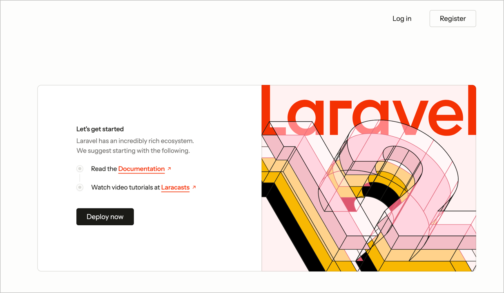
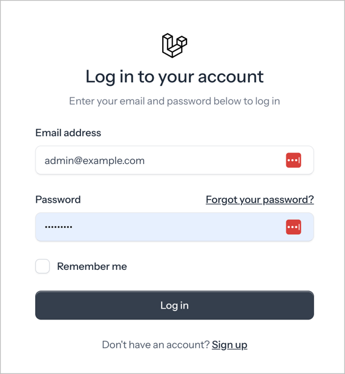
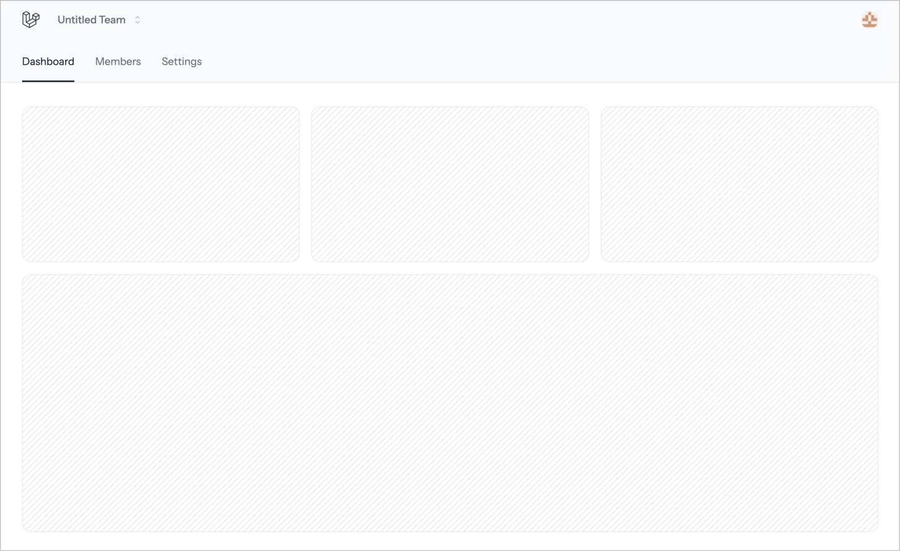
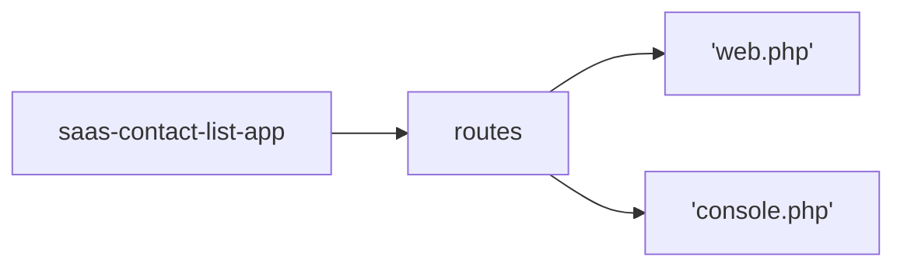
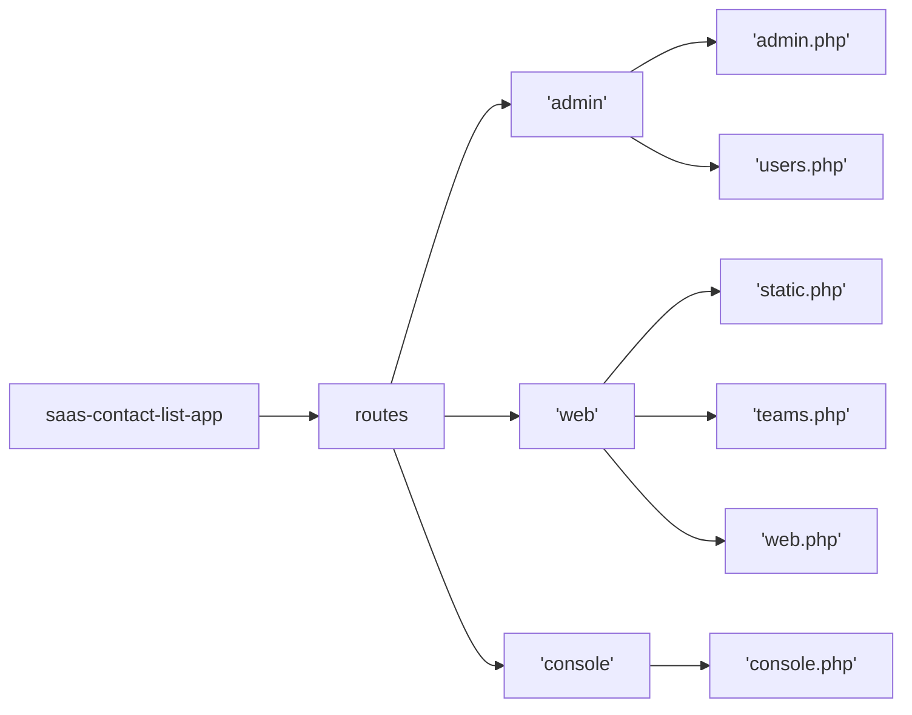

Create Base Application using:

```shell
laravel new saas-contact-list-app  \
  --using=imacrayon/blade-starter-kit --git \ 
  --database=sqlite --pnpm

cd saas-contact-list-app
```

Add the LaraDumps package to enable the App to talk to LaraDumps App.

```shell
composer require --dev laradumps/laradumps 
```

Freshen up the ReadMe.md file (this file)

```shell
touch Readme.md
```

Perform the initial migrations and seed the database:

```shell
php artisan migrate:fresh --seed
```

Either split your shell into two parts, or open another shell.

Make sure that your current folder shows the saas-contact-list-app folder. If not use the
`cd` command to move into the correct folder/directory.

```shell
pwd
```

In the second shell run the application:

```shell
composer run dev
```

Most commands will be executed in the first shell, leaving the application to continue
running in the background.

Open the default application on a web browser: [http://localhost:8000](http://localhost:8000).



Create an Update User Migration

We need to add a few fields to the user model, so we will create a new migration:

```shell
php artisan make:migration update_users_add_name
```

Open and edit the `database/migrations/yyyy_mm_dd_hhmmss_update_users_ad_name.php` file:

Update the `up` and `down` methods:

```php
public function up(): void
    {
        Schema::table('users', function (Blueprint $table) {
            $table->string('name',32);
        });
    }


    public function down(): void
    {
        Schema::table('users', function (Blueprint $table) {
            $table->dropColumn('name');
        });
    }

```

Create User Seeder

```shell
php artisan make:seeder UserSeeder
```

Edit the `database/seeders/UserSeeder.php` file.

Update the run method to read:

```php
public function run(): void
{
    $seedUsers = [
        [
            'id' => 99,
            'name' => 'Super Admin',
            'first_name' => 'Super',
            'last_name' => 'Admin',
            'email' => 'supervisor@example.com',
            'password' => 'Password1',
            'email_verified_at' => now(),
            'roles' => ['super-user','admin',],
            'team_role' => 'admin',
            'permissions' => [],
        ],

        [
            'id' => 100,
            'name' => 'Admin I Strator',
            'first_name' => 'Admin',
            'last_name' => 'I Strator',
            'email' => 'admin@example.com',
            'password' => 'Password1',
            'email_verified_at' => now(),
            'roles' => ['admin'],
            'team_role' => 'admin',
            'permissions' => [],
        ],

        [
            'id' => 200,
            'name' => 'Staff User',
            'first_name' => 'Staff',
            'last_name' => 'User',
            'email' => 'staff@example.com',
            'password' => 'Password1',
            'email_verified_at' => now(),
            'roles' => ['staff'],
            'team_role' => 'admin',
            'permissions' => [],
        ],

        [
            'id' => 300,
            'name' => 'Client User',
            'first_name' => 'Client',
            'last_name' => 'User',
            'email' => 'client@example.com',
            'password' => 'Password1',
            'email_verified_at' => now(),
            'roles' => ['client'],
            'team_role' => 'member',
            'permissions' => [],
        ],

        [
            'id' => 301,
            'name' => 'Client User II',
            'first_name' => 'Client',
            'last_name' => 'User II',
            'email' => 'client2@example.com',
            'password' => 'Password1',
            'email_verified_at' => null,
            'roles' => ['client'],
            'team_role' => 'member',
            'permissions' => [],
        ],

        [
            'id' => 302,
            'name' => 'Client User III',
            'first_name' => 'Client',
            'last_name' => 'User III',
            'email' => 'client3@example.com',
            'password' => 'Password1',
            'email_verified_at' => null,
            'roles' => ['client'],
            'team_role' => 'member',
            'permissions' => [],
        ],
    ];

    foreach ($seedUsers as $newUser) {
    
        // Assign user as team member by default
        // This app template has the Teams feature enabled 
        $newUser['role'] = $roles['team_role']??"member";
        unset($newUser['team_role']);

        // Grab the roles & additional permissions from the seed users.
        // This is used by Spatie Permissions package.
        $roles = $newUser['roles'];
        unset($newUser['roles']);

        $permissions = $newUser['permissions'];
        unset($newUser['permissions']);

        $user = User::updateOrCreate(
            ['id' => $newUser['id']],
            $newUser
        );

        // Uncomment this line when using Spatie Permissions
        // $user->assignRole($roles);
        // $user->assignPermissions($permissions);

    }

    // Uncomment the line below to create (10) randomly named users using the User Factory.
    // User::factory(10)->create();
}
```

Open the `database/seeders/DatabaseSeeder.php` file.

Update the class definition to include `WithoutModelEvents`.

```php
namespace Database\Seeders;

use App\Models\User;
use Illuminate\Database\Console\Seeds\WithoutModelEvents;
use Illuminate\Database\Seeder;

class DatabaseSeeder extends Seeder
{
    use WithoutModelEvents;
```

> This tells Laravel NOT to trigger any events such as sending emails that may
> be tied to the creation of user models.

Update the run method in the `database/seeders/DatabaseSeeder.php` file to read:

```php
        $this->call([
            UserSeeder::class,
            //CategorySeeder::class,
            //ContactSeeder::class,

            // This is for demo purposes only
            // DemoSeeder::class,
        ]);
    }
```

Re-execute the migration command:

```shell
php artisan migrate:fresh --seed
```

> IMPORTANT: The `:fresh` resets the database tables to have records. **DO NOT** use it
> on a production database.

You should not have any errors at this point.

Go back to your browser and click the Log in button.



Enter one of the sets of data shown below:

| Item          | Administrator User  | Client User          |
|---------------|---------------------|----------------------|
| Email address | `admin@example.com` | `client@example.com` |
| Password      | `Password1`         | `Password1`          |

> At the moment no difference will be seen between admin and client, per-se.

Logging in will present the default 'dashboard':



Commit work so far

```shell
git add .
git commit -m 'chore: Update & Seed users 
    - Add name field via update migration
    - seed users table via SeedUsers seeder'
```

---

Re-organise Routes

We are going to re-organise the routes to make the code more manageable and expandable.

Current structure is:



We will restructure to:



Create teh folders using:
```shell
mkdir -p routes/{web,admin,console}
touch routes/{web,admin,console}/default.php
touch routes/web/{teams,static,profile}.php
touch routes/admin/users.php

cp routes/console.php routes/console/inspire.php
cp routes/console.php routes/console/console.php
cp routes/web.php routes/web/web.php
```

> This creates some empty files ready, plus also copies the original routes files into 
> their respective folders. These, temporarily, act as a backup of the originals.

Open the `routes/console.php` file and update to read:

```php
<?php
# Console Routes
include_once 'console/inspire.php';

# include route files for individual console commands, or groups of related commands.
```

Likewise, open the `routes/web.php` file and update it to read:

```php
<?php
# Static page routes: home, about, privacy, et al

$basePath = dirname(__DIR__);

include_once "{$basePath}/routes/web/static.php";

# Logged-in User Profile routes
include_once "{$basePath}/routes/web/profile.php";

# Teams Routes
include_once "{$basePath}/routes/web/teams.php";

# Administration: Users
include_once "{$basePath}/routes/admin/users.php";

# This should be empty, but may be used to hold general routes
include_once "{$basePath}/routes/web/web.php";

```

> You should see the browser automatically refresh when you save changed files.
>
> You will also see errors when an issue arises due to a problem in a PHP file.

We are now going to copy code from the backup files into the respective route files.

> As these files are larger in most cases, we will link to the source files for viewing:
> 
> - [`routes/web/static.php`](routes/web/static.php)
> - [`routes/web/profile.php`](routes/web/profile.php)
> - [`routes/web/teams.php`](routes/web/teams.php)
> - [`routes/admin/users.php`](routes/admin/users.php)
> - [`routes/console/inspire.php`](routes/console/inspire.php)
> - [web.php](routes/web/web.php)
> - [console.php](routes/console/console.php)
> - 

You should comment out ALL the `routes/web/web.php` routes as they have been moved to 
representational files above (e.g. teams routes to the `teams.php` route file). Likewise, 
the same should be done for the `routes/console/console.php` routes.

Once completed all the routes should still function as expected.
